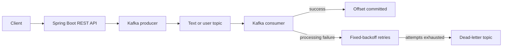

# Spring Boot Kafka Demo

A small, production-aware demonstration of publishing and consuming text and JSON messages with Spring Boot and Apache Kafka. The project keeps the original API and topic names while adding validation, explicit delivery settings, safe deserialization, retry and dead-letter handling, health reporting, and deterministic tests.

## What this project demonstrates

- A REST API that publishes text and `User` messages to separate Kafka topics
- Type-specific producer serialization and consumer deserialization
- Message keys for partition affinity and traceable logs
- Manual offset management through record acknowledgment and disabled auto-commit
- Listener retries followed by dead-letter topic recovery
- Request validation and RFC 9457 Problem Details errors
- Kafka-aware Actuator health reporting
- Local Kafka in KRaft mode with Docker Compose
- Unit, MVC, serialization, and embedded-Kafka integration tests

## Technologies

- Java 17
- Spring Boot 3.5.16
- Spring for Apache Kafka 3.3.16
- Apache Kafka clients and Docker image 3.9.2
- Maven Wrapper 3.3.2 with Maven 3.9.9
- JUnit 5, Mockito, MockMvc, and embedded Kafka

Dependency versions are managed by the Spring Boot parent unless the project has a concrete reason to override them.

## Architecture and message flow



The text producer generates a UUID key. The user producer uses the user ID as the key, so updates for the same ID retain partition ordering. A broker acknowledgment is required before the REST call succeeds. The consumers log message metadata, not complete payloads.

This demo uses at-least-once consumption. Producer idempotence prevents duplicate writes within a producer session, but consumers must still tolerate duplicates caused by application restarts, rebalances, or client retries.

## Kafka resources

| Purpose | Default name | Value type |
| --- | --- | --- |
| Text messages | `kafkalearn` | UTF-8 string |
| User messages | `kafkalearn_json` | JSON `User` |
| Failed text messages | `kafkalearn.dlt` | Original value |
| Failed user messages | `kafkalearn_json.dlt` | Original value |

All topics default to three partitions and replication factor one. The consumer group defaults to `myGroup`. These settings suit the single-broker local environment; increase the replication factor for a multi-broker production cluster.

Auto-commit is disabled and listener acknowledgment mode is `RECORD`. A listener exception is retried with a fixed backoff for three total delivery attempts by default. After attempts are exhausted, the original record is written to the matching `.dlt` topic and its offset can advance. Deserialization and validation failures are recovered to the DLT without invoking the listener.

## Project structure

```text
.
├── .github/                  # CI, dependency updates, and PR template
├── src/main/java/.../
│   ├── config/               # Typed properties, topics, producer/consumer/error setup
│   ├── controller/           # REST endpoints and global error handling
│   ├── kafka/                # Producers, consumers, health, and publish exception
│   └── model/                # API/message models
├── src/main/resources/       # Application configuration
├── src/test/                 # Unit, MVC, serialization, and Kafka integration tests
├── compose.yaml              # Single-node Kafka and optional application service
├── Dockerfile                # Java 17 multi-stage application image
├── requests.http             # Ready-to-run API examples
└── REPOSITORY_REVIEW.md      # Technical audit and modernization record
```

## Prerequisites

- Java 17 or newer to run Maven (the project compiles for Java 17)
- Docker with Compose v2 for the recommended local Kafka setup
- Git

No system Maven installation is required.

## Get started

Clone the repository:

```bash
git clone https://github.com/mohamedtamer0/ImplKafka-SpringBoot-Demo.git
cd ImplKafka-SpringBoot-Demo
```

Start Kafka:

```bash
docker compose up -d kafka
docker compose ps
```

Run the application on the host:

```bash
./mvnw spring-boot:run
```

The API listens on `http://localhost:8081`. Spring creates the application and dead-letter topics when Kafka becomes available.

To build and run both Kafka and the application in containers instead:

```bash
docker compose --profile app up --build
```

Stop the environment and remove its ephemeral data:

```bash
docker compose --profile app down
```

## API

### Publish a text message

The POST endpoint is preferred:

```bash
curl --fail-with-body \
  --request POST http://localhost:8081/api/v1/kafka/messages \
  --header 'Content-Type: application/json' \
  --data '{"message":"Hello Kafka"}'
```

Expected response (`200 OK`):

```text
Message sent to the topic
```

The original GET endpoint remains available for backward compatibility:

```bash
curl --fail-with-body --get http://localhost:8081/api/v1/kafka/publish \
  --data-urlencode 'message=Hello Kafka'
```

### Publish a user message

```bash
curl --fail-with-body \
  --request POST http://localhost:8081/api/v1/kafka/users \
  --header 'Content-Type: application/json' \
  --data '{"id":1,"firstName":"Mohamed","lastName":"Tamer"}'
```

Expected response (`200 OK`):

```text
Json message sent to kafka topic
```

The legacy `POST /api/v1/kafka/publish` route accepts the same JSON body.

User IDs must be positive. Names must be nonblank and at most 100 characters. Text messages must be nonblank and at most 1,000 characters. Invalid input returns `400 Bad Request` with `application/problem+json`, for example:

```json
{
  "type": "about:blank",
  "title": "Bad Request",
  "status": 400,
  "detail": "Request validation failed",
  "instance": "/api/v1/kafka/users",
  "errors": [
    {"field": "id", "message": "must be greater than 0"}
  ]
}
```

If Kafka does not acknowledge a publish within the configured timeout, the API returns `503 Service Unavailable`.

### Health

```bash
curl --fail-with-body http://localhost:8081/actuator/health
```

Only the `health` and `info` Actuator endpoints are exposed. Health is `DOWN` when Kafka cannot be reached.

The same examples are available in [`requests.http`](requests.http) for IDE HTTP clients.

## Test with Postman

Start Kafka and the application first, then create a Postman environment with this variable:

| Variable | Initial value | Current value |
| --- | --- | --- |
| `baseUrl` | `http://localhost:8081` | `http://localhost:8081` |

Use the following requests to exercise the main API behavior.

### 1. Check Kafka health

- Method: `GET`
- URL: `{{baseUrl}}/actuator/health`
- Expected status: `200 OK`
- Expected Kafka component status: `UP`

If Kafka is stopped or unreachable, expect `503 Service Unavailable` with overall status `DOWN`.

### 2. Publish a text message

- Method: `POST`
- URL: `{{baseUrl}}/api/v1/kafka/messages`
- Header: `Content-Type: application/json`
- Body: select **raw** and **JSON**, then enter:

```json
{
  "message": "Hello from Postman"
}
```

Expected status: `200 OK`. Expected response body:

```text
Message sent to the topic
```

### 3. Publish a user message

- Method: `POST`
- URL: `{{baseUrl}}/api/v1/kafka/users`
- Header: `Content-Type: application/json`
- Body: select **raw** and **JSON**, then enter:

```json
{
  "id": 1,
  "firstName": "Mohamed",
  "lastName": "Tamer"
}
```

Expected status: `200 OK`. Expected response body:

```text
Json message sent to kafka topic
```

### 4. Verify validation

Repeat the user request with an invalid ID and blank first name:

```json
{
  "id": 0,
  "firstName": "",
  "lastName": "Tamer"
}
```

Expected status: `400 Bad Request`, with an `application/problem+json` response containing validation errors for `id` and `firstName`.

### 5. Confirm Kafka consumption

After sending valid requests, check the Spring Boot logs. The text and user consumers should log the Kafka topic, key, partition, and offset. Payload contents are deliberately omitted from logs. You can also inspect records directly with the Kafka commands in [Inspect Kafka locally](#inspect-kafka-locally).

Postman users who prefer the original routes can also test `GET {{baseUrl}}/api/v1/kafka/publish?message=Hello` for text and `POST {{baseUrl}}/api/v1/kafka/publish` for a user. These routes are retained for backward compatibility.

## Configuration

Application defaults live in `src/main/resources/application.yml`. Override environment-specific values without editing source:

| Environment variable | Default | Description |
| --- | --- | --- |
| `KAFKA_BOOTSTRAP_SERVERS` | `localhost:9092` | Comma-separated Kafka brokers |
| `SERVER_PORT` | `8081` | HTTP port |
| `KAFKA_TEXT_TOPIC` | `kafkalearn` | Text topic |
| `KAFKA_USER_TOPIC` | `kafkalearn_json` | User topic |
| `KAFKA_CONSUMER_GROUP` | `myGroup` | Consumer group |
| `KAFKA_CONSUMER_CONCURRENCY` | `1` | Listener threads per listener |
| `KAFKA_TOPIC_PARTITIONS` | `3` | Partition count for declared topics |
| `KAFKA_TOPIC_REPLICATION_FACTOR` | `1` | Topic replication factor |
| `KAFKA_DEAD_LETTER_SUFFIX` | `.dlt` | Dead-letter topic suffix |
| `KAFKA_RETRY_MAX_ATTEMPTS` | `3` | Total listener delivery attempts |
| `KAFKA_RETRY_BACKOFF` | `1s` | Delay between listener attempts |
| `KAFKA_SEND_TIMEOUT` | `12s` | Maximum wait for producer completion |

Copy `.env.example` to `.env` if you want Docker Compose to load local overrides. Never commit `.env`.

Producer defaults use `acks=all`, three Kafka-client retries, idempotence, a 10-second delivery deadline, a five-second metadata/buffer blocking limit, and at most five in-flight requests per connection. This combination preserves ordering for a keyed partition while retries are enabled and bounds API waits when no broker is reachable.

## Build and tests

Run the complete clean build, including the embedded-Kafka integration suite:

```bash
./mvnw clean verify
```

The integration tests start an in-process single-node KRaft broker on a random local port; Docker is not required. They verify REST-to-consumer delivery, listener retries, malformed JSON recovery to a DLT, and Kafka health. A local security policy must allow the test JVM to bind loopback ports.

Create the executable JAR without rerunning tests:

```bash
./mvnw package -DskipTests
java -jar target/ImplKafka-SpringBoot-Demo-0.0.1-SNAPSHOT.jar
```

## Inspect Kafka locally

List topics:

```bash
docker compose exec kafka /opt/kafka/bin/kafka-topics.sh \
  --bootstrap-server kafka:19092 --list
```

Read user dead-letter records and headers:

```bash
docker compose exec kafka /opt/kafka/bin/kafka-console-consumer.sh \
  --bootstrap-server kafka:19092 \
  --topic kafkalearn_json.dlt \
  --from-beginning \
  --property print.key=true \
  --property print.headers=true
```

## Troubleshooting

- **Connection to node could not be established:** confirm `docker compose ps` reports Kafka healthy and that host-run applications use `localhost:9092`. The containerized app uses `kafka:19092`.
- **Topic replication-factor error:** a single broker supports replication factor one only. Set a higher value only when enough brokers are available.
- **Unknown topic or partition:** wait for Kafka health, then restart the application so its `NewTopic` declarations run. Check names with the topic-list command above.
- **Messages appear to be missing:** consumer offsets belong to `KAFKA_CONSUMER_GROUP`. Use a new group to replay from the beginning, or inspect offsets with Kafka's consumer-groups tool.
- **A record repeatedly fails:** inspect application retry logs and the corresponding `.dlt` topic. DLT records retain Kafka exception headers for diagnosis.
- **Health returns 503:** verify broker reachability and advertised listeners. Do not use `localhost:9092` from one container to reach another container.
- **Tests cannot bind a port:** allow local loopback socket binding in the sandbox or endpoint-security tool running Maven.

## Deliberate limitations and future ideas

This is a learning project, so the Compose environment is a single, plaintext, ephemeral broker. A production deployment should use multiple brokers, replication, TLS/SASL, access controls, persistent storage, monitoring, and organization-specific retention policies. Other useful extensions are a DLT replay workflow, schema evolution with a registry, consumer-side idempotency backed by durable storage, OpenAPI documentation, and trace-context propagation.

See [`REPOSITORY_REVIEW.md`](REPOSITORY_REVIEW.md) for the full audit, decisions, and remaining owner choices.

## License

Licensed under the [Apache License 2.0](LICENSE).
